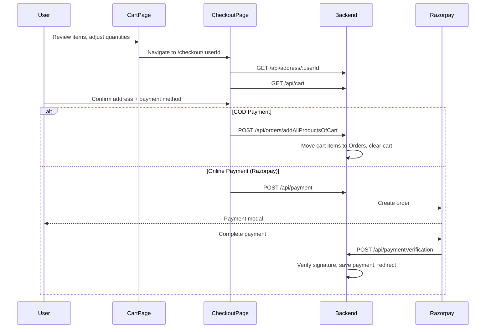

# Cart System

## Overview

The cart system allows authenticated customers to add products with a specific **color** and **size** selection, adjust quantities, and proceed to checkout. Cart data is stored server-side in MongoDB (not localStorage), so it persists across devices.

---

## Backend Files

| File                     | Purpose                         |
| ------------------------ | ------------------------------- |
| `controllers/cart.js`    | All cart CRUD logic             |
| `routes/cartRoutes.js`   | Cart route definitions          |
| `models/Cart.js`         | Cart item schema                |

## Frontend Files

| File                          | Purpose                         |
| ----------------------------- | ------------------------------- |
| `components/customer/Cart.jsx`| Cart page UI                    |
| `store/features/cartSlice.js` | Redux cart state (fetch thunk)  |

---

## API Endpoints (`/api/cart`)

| Method | Endpoint                          | Description                                  |
| ------ | --------------------------------- | -------------------------------------------- |
| GET    | `/`                               | Get all cart items for the authenticated user |
| POST   | `/addProduct/:productId`          | Add product to cart (or update if exists)     |
| PUT    | `/changeProductQuantity/:productId` | Update quantity, color, size                |
| DELETE | `/:productId`                     | Remove product from cart                     |

---

## Controller Functions

### `handleGetCart(req, res)`

Retrieves all cart items for the authenticated user with populated product data.

**Flow:**
1. Extracts `userId` from `authToken` cookie
2. Queries `Cart.find({ userId })` with `.populate('productId')`
3. Filters out any cart items where the product no longer exists
4. Maps to response format with product details + selected options
5. Calculates `totalAmount` with discount applied

**Response:**
```json
{
  "count": 3,
  "items": [
    {
      "product": {
        "_id": "...",
        "name": "Cotton Shirt",
        "price": 1500,
        "discountPercent": 10,
        "availableColors": [...],
        "stock": 25
      },
      "quantity": 2,
      "selectedColor": "Blue",
      "selectedSize": "L",
      "itemAddedAt": "2026-03-20T..."
    }
  ],
  "totalAmount": 2700.00,
  "currency": "INR"
}
```

**Price Formula:**
```
itemTotal = quantity × (price - (price × discountPercent / 100))
```

### `handleAddProductToCart(req, res)`

**Input:** `{ selectedColor, selectedSize, quantity }` + `:productId` param

**Logic:**
- If the product is already in the user's cart → **updates** quantity, color, size
- If not → **creates** a new cart entry
- This means a user can only have one entry per product (latest selection wins)

### `handleUpdateProductQuantity(req, res)`

**Input:** `{ quantity, selectedColor, selectedSize }` + `:productId` param

Updates an existing cart item using `findOneAndUpdate` with `$set`.

### `handleDeleteProductFromCart(req, res)`

Removes a single product from the cart using `findOneAndDelete`.

### `getTotalAmountFromCart(userId)` *(Helper — not an endpoint)*

Internal function used by the checkout process to calculate cart total.

---

## Data Model

### `Cart` Schema

| Field          | Type                  | Description                         |
| -------------- | --------------------- | ----------------------------------- |
| `userId`       | ObjectId (ref: User)  | Required. The cart owner            |
| `productId`    | ObjectId (ref: Product) | The product in the cart           |
| `quantity`     | Number                | Required. Default: 1               |
| `selectedColor`| String                | Chosen color variant                |
| `selectedSize` | String                | Chosen size                         |
| `createdAt`    | Date                  | Auto-managed                        |
| `updatedAt`    | Date                  | Auto-managed                        |

---

## Cart → Checkout Flow


