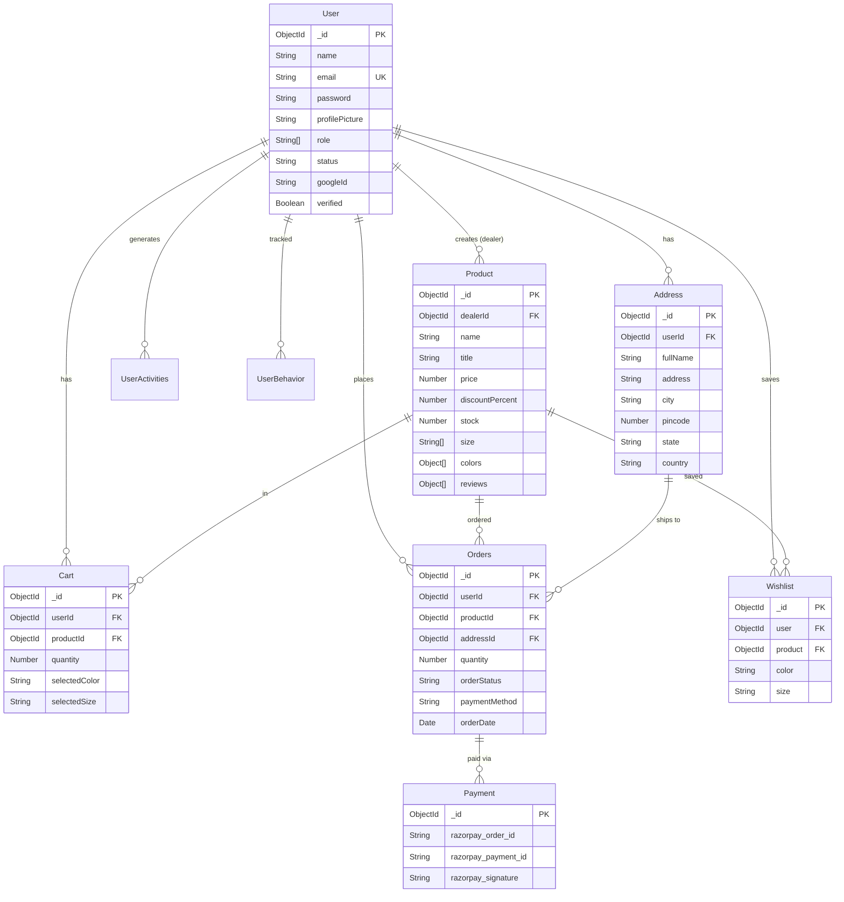

# Database Models Reference

## Overview

Adaa uses **MongoDB** with **Mongoose** ODM. All models are defined in `backend/models/`. This document provides a consolidated reference of every schema.

---

## Entity Relationship Diagram



---

## Model Details

### 1. User (`models/User.js`)

| Field            | Type        | Required | Default                          | Notes                              |
| ---------------- | ----------- | -------- | -------------------------------- | ---------------------------------- |
| `name`           | String      | ✅       | —                                |                                    |
| `email`          | String      | ✅       | —                                | Unique index                       |
| `password`       | String      | ❌       | —                                | Null for Google users              |
| `profilePicture` | String      | ❌       | Cloudinary default avatar URL    |                                    |
| `otp`            | String      | ❌       | —                                | For forgot-password flow           |
| `otpExpiresAt`   | Date        | ❌       | —                                | OTP expiry timestamp               |
| `role`           | [String]    | ❌       | `["customer"]`                   | Enum: customer, dealer, admin      |
| `status`         | String      | ❌       | `"active"`                       |                                    |
| `devices`        | [String]    | ❌       | `[]`                             | Device identifiers                 |
| `googleId`       | String      | ❌       | —                                | Google OAuth profile ID            |
| `membership`     | String      | ❌       | —                                | Membership tier                    |
| `userType`       | String      | ❌       | —                                | `"google"` for OAuth users         |
| `verified`       | Boolean     | ❌       | `false`                          | Email verification status          |

**Timestamps:** ✅ `createdAt`, `updatedAt`

---

### 2. TempUser (`models/TempUserModel.js`)

Temporary storage during OTP verification. Auto-deletes after 10 minutes via MongoDB TTL index.

| Field          | Type   | Required | Notes                              |
| -------------- | ------ | -------- | ---------------------------------- |
| `name`         | String | ✅       |                                    |
| `email`        | String | ✅       | Unique                             |
| `password`     | String | ✅       | Bcrypt-hashed                      |
| `otp`          | String | ✅       | 6-digit code                       |
| `otpExpiresAt` | Date   | ✅       | TTL index: `{ expires: '10m' }`    |

---

### 3. Product (`models/Product.js`)

| Field               | Type                | Required | Default | Notes                           |
| ------------------- | ------------------- | -------- | ------- | ------------------------------- |
| `dealerId`          | ObjectId (ref: User)| ✅       | —       | Creator                         |
| `name`              | String              | ✅       | —       |                                 |
| `title`             | String              | ✅       | —       |                                 |
| `description`       | String              | ❌       | —       |                                 |
| `brand`             | String              | ❌       | —       |                                 |
| `price`             | Number              | ✅       | —       | In INR                          |
| `categoryOfProduct` | String              | ❌       | —       |                                 |
| `gender`            | String              | ❌       | —       |                                 |
| `size`              | [String]            | ❌       | —       | Enum: XXS–6XL                   |
| `colors`            | Array               | ❌       | —       | `[{ colorName, images[] }]`     |
| `material`          | String              | ❌       | —       |                                 |
| `discountPercent`   | Number              | ❌       | —       |                                 |
| `productType`       | String              | ❌       | `"new"` |                                 |
| `stock`             | Number              | ❌       | `0`     |                                 |
| `reviews`           | Array               | ❌       | —       | `[{ userId, rating, comment }]` |
| `features`          | [String]            | ❌       | —       |                                 |
| `offers`            | Object              | ❌       | —       | `{ bankOffers, partnersOffers }`|
| `warrantyDetails`   | String              | ❌       | —       |                                 |

**Timestamps:** ✅ `createdAt`, `updatedAt`

**Colors sub-document:**
```js
{
    colorName: String,   // e.g., "Red"
    images: [String]     // Array of Cloudinary URLs
}
```

**Reviews sub-document:**
```js
{
    userId: ObjectId,    // ref: User
    rating: Number,      // 0–5
    comment: String,
    sales: Number,       // default: 0
    createdAt: Date      // default: Date.now
}
```

---

### 4. Cart (`models/Cart.js`)

| Field          | Type                    | Required | Default    |
| -------------- | ----------------------- | -------- | ---------- |
| `userId`       | ObjectId (ref: User)    | ✅       | —          |
| `productId`    | ObjectId (ref: Product) | ❌       | —          |
| `quantity`     | Number                  | ✅       | `1`        |
| `selectedColor`| String                 | ❌       | —          |
| `selectedSize` | String                 | ❌       | —          |

**Timestamps:** ✅ `createdAt`, `updatedAt`

---

### 5. Orders (`models/Orders.js`)

| Field            | Type                    | Required | Default       |
| ---------------- | ----------------------- | -------- | ------------- |
| `userId`         | ObjectId (ref: User)    | ✅       | —             |
| `productId`      | ObjectId (ref: Product) | ❌       | —             |
| `price`          | Number                  | ❌       | —             |
| `discount`       | Number                  | ❌       | —             |
| `addressId`      | ObjectId (ref: Address) | ❌       | —             |
| `quantity`       | Number                  | ✅       | `1`           |
| `orderType`      | String                  | ✅       | —             |
| `paymentMethod`  | String                  | ❌       | —             |
| `paymentStatus`  | String                  | ❌       | —             |
| `orderStatus`    | String                  | ❌       | `"success"`   |
| `orderDate`      | Date                    | ❌       | `Date.now`    |
| `deliveryDate`   | Date                    | ❌       | —             |
| `deliveryBoyId`  | ObjectId                | ❌       | —             |

**Timestamps:** ✅ `createdAt`, `updatedAt`

---

### 6. Wishlist (`models/WishList.js`)

| Field      | Type                    | Required | Default    |
| ---------- | ----------------------- | -------- | ---------- |
| `user`     | ObjectId (ref: User)    | ✅       | —          |
| `product`  | ObjectId (ref: Product) | ✅       | —          |
| `color`    | String                  | ✅       | —          |
| `size`     | String                  | ✅       | —          |
| `createdAt`| Date                    | ❌       | `Date.now` |

---

### 7. Address (`models/Address.js`)

| Field       | Type                  | Required | Notes           |
| ----------- | --------------------- | -------- | --------------- |
| `userId`    | ObjectId (ref: User)  | ✅       |                 |
| `fullName`  | String                | ✅       |                 |
| `address`   | String                | ✅       | Street address  |
| `city`      | String                | ✅       |                 |
| `pincode`   | Number                | ✅       |                 |
| `state`     | String                | ✅       |                 |
| `country`   | String                | ✅       |                 |
| `latitude`  | Number                | ❌       | Geo-coordinate  |
| `longitude` | Number                | ❌       | Geo-coordinate  |

**Timestamps:** ✅ `createdAt`, `updatedAt`

---

### 8. Payment (`models/Payment.js`)

| Field                  | Type   | Required |
| ---------------------- | ------ | -------- |
| `razorpay_order_id`    | String | ✅       |
| `razorpay_payment_id`  | String | ✅       |
| `razorpay_signature`   | String | ✅       |

---

### 9. StaticImages (`models/StaticImages.js`)

Singleton document — only one exists in the collection.

| Field               | Type      | Default                         |
| ------------------- | --------- | ------------------------------- |
| `heroSection.left`  | String    | Unsplash URL                    |
| `heroSection.right` | String    | Unsplash URL                    |
| `brands`            | [String]  | Array of 4 brand logo URLs      |
| `deals`             | [String]  | Array of 3 deal image URLs      |
| `instagram`         | [String]  | Array of 7 Instagram image URLs |

Indexed fields: `brands`, `deals`, `instagram`

---

### 10. UserActivities (`models/UserActivities.js`)

| Field              | Type                                       | Required |
| ------------------ | ------------------------------------------ | -------- |
| `userId`           | ObjectId (ref: User)                       | ✅       |
| `searchedProducts` | `[{ productId: ObjectId, searchTimestamp: Date }]` | ❌ |
| `viewedProducts`   | `[{ productId: ObjectId, viewTimestamp: Date }]`   | ❌ |
| `purchasedProducts`| [ObjectId]                                 | ❌       |
| `wishlist`         | ObjectId (ref: Wishlist)                   | ❌       |
| `cartId`           | ObjectId (ref: Cart)                       | ❌       |

**Timestamps:** ✅ `createdAt`, `updatedAt`

---

### 11. UserBehavior (`models/UserBehavior.js`)

Tracks payment behavior for COD restriction logic.

| Field                     | Type    | Default | Notes                       |
| ------------------------- | ------- | ------- | --------------------------- |
| `userId`                  | ObjectId| —       | Required. Ref: User         |
| `rejected_cod_count`      | Number  | `0`     |                             |
| `cod_returns_count`       | Number  | `0`     |                             |
| `successful_prepaid_count`| Number  | `0`     |                             |
| `cod_restricted`          | Boolean | `false` | Flag to disable COD         |
| `restriction_reason`      | String  | `""`    | Reason for restriction      |
| `last_updated`            | Date    | `Date.now` |                          |

**Timestamps:** ✅ `createdAt`, `updatedAt`
