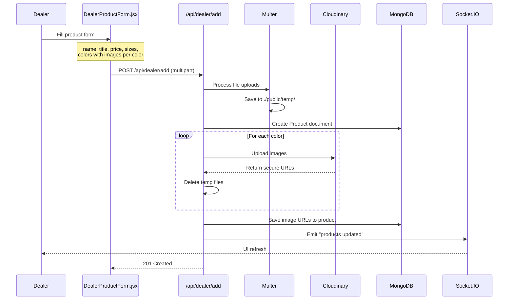
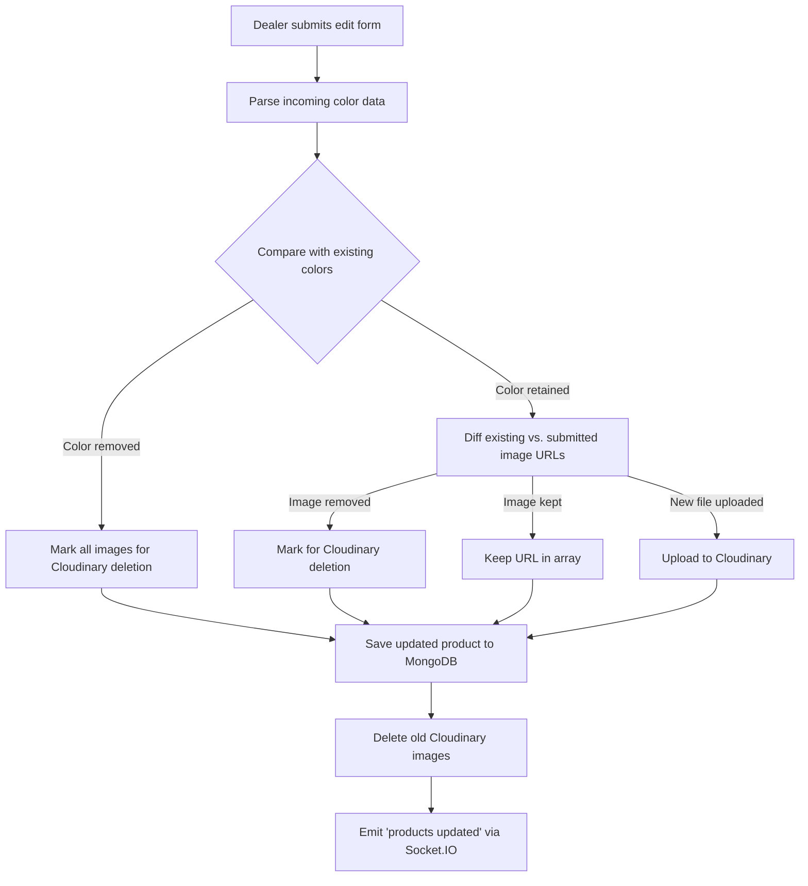

# Dealer Panel

## Overview

Dealers are users with the `"dealer"` role who can manage their own product catalog. A dealer can add new products with multi-color image galleries, edit existing products, and delete products they own. All dealer routes are protected by the `checkForDealerAuthentication` middleware.

A user becomes a dealer when an **admin** assigns them the `"dealer"` role via the Admin Permissions page.

---

## Backend Files

| File                          | Purpose                                |
| ----------------------------- | -------------------------------------- |
| `controllers/dealer.js`      | Dealer-specific product queries        |
| `controllers/products.js`    | Shared product CRUD (used by dealers)  |
| `routes/dealerRoutes.js`     | Dealer route definitions               |
| `middlewares/dealer.js`      | Dealer role verification middleware    |

## Frontend Files

| File                                         | Purpose                              |
| -------------------------------------------- | ------------------------------------ |
| `components/dealer/DealerProducts.jsx`       | List all dealer's own products       |
| `components/dealer/DealerProductDetail.jsx`  | View a single product in detail      |
| `components/dealer/DealerProductForm.jsx`    | Add a new product form               |
| `components/dealer/DealerProductEditForm.jsx`| Edit an existing product form        |

---

## API Endpoints (`/api/dealer`) — *Requires dealer role*

| Method | Endpoint              | Description                                       |
| ------ | --------------------- | ------------------------------------------------- |
| GET    | `/getAllProducts`      | Get all products owned by the authenticated dealer |
| POST   | `/add`                | Add a new product with color-wise image uploads    |
| PUT    | `/updateProduct`      | Update an existing product with image changes      |
| DELETE | `/deleteProduct/:id`  | Delete a product and its Cloudinary images         |

---

## Middleware

### `checkForDealerAuthentication(req, res, next)`

```js
async function checkForDealerAuthentication(req, res, next) {
    const user = await giveUserFromDb(req.cookies.authToken);
    if (!user.role.includes("dealer")) {
        return res.status(403).send("Not authorized to authenticate");
    }
    return next();
}
```

Applied in `index.js`:
```js
app.use('/api/dealer', checkForDealerAuthentication, dealerRouter);
```

---

## Controller Functions

### `giveProducts(req, res)` — *from `controllers/dealer.js`*

Returns only the products belonging to the authenticated dealer:

```js
const userId = giveUserIdFromCookies(req.cookies.authToken);
const products = await Product.find({ dealerId: new ObjectId(userId) });
```

### Shared Product Functions — *from `controllers/products.js`*

The dealer routes reuse these shared product controllers:

| Function         | Dealer Route          | Description                                    |
| ---------------- | --------------------- | ---------------------------------------------- |
| `addProduct`     | `POST /add`           | Create product with color-wise image uploads    |
| `updateProduct`  | `PUT /updateProduct`  | Update product fields + manage image lifecycle  |
| `removeProduct`  | `DELETE /deleteProduct/:id` | Delete product + all Cloudinary images    |

See [Products documentation](./03-products.md) for full function details.

---

## Product Creation Workflow



---

## Product Editing Workflow

The edit flow is more complex because it must handle:

1. **Retained images** — images that the dealer kept (no re-upload needed)
2. **Removed images** — images the dealer deleted (must delete from Cloudinary)
3. **New images** — newly uploaded files (must upload to Cloudinary)
4. **Removed colors** — entire color variants deleted (delete all their images)
5. **New colors** — entirely new color variants added



---

## Frontend Components

### `DealerProducts.jsx`
- Fetches dealer's products via `GET /api/dealer/getAllProducts`
- Displays product cards with name, price, stock, first image
- Links to detail view and edit form
- Delete button with confirmation

### `DealerProductForm.jsx` (27 KB)
- Large form component for creating products
- Dynamic color management — add/remove color variants
- Per-color file upload with image preview
- Size selection (checkbox grid)
- Fields: name, title, description, price, discount, stock, brand, category, gender, material

### `DealerProductEditForm.jsx` (37 KB)
- Similar to create form but pre-populated with existing data
- Shows existing images with delete capability
- Tracks which existing images to keep vs. remove
- Passes `existingImagesByColor` to the backend for diff logic

### `DealerProductDetail.jsx`
- Read-only detail view of a single product
- Color-wise image gallery
- All product fields displayed
