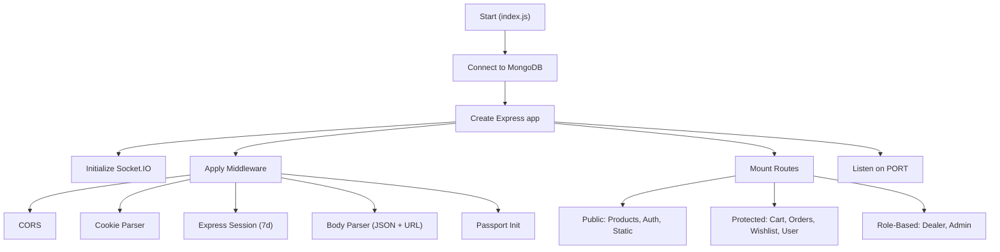

# Middleware, Services & Utilities

## Overview

This document covers the shared backend infrastructure — authentication middlewares, file upload configuration, Cloudinary service, Socket.IO integration, and other utility services.

---

## Middleware Layer

### Role-Based Access Control

All role middlewares follow the same pattern: decode JWT → fetch user from DB → check `role` array → allow or deny.

#### `middlewares/admin.js` — `checkForAdminAuthentication`

```js
async function checkForAdminAuthentication(req, res, next) {
    const user = await giveUserFromDb(req.cookies.authToken);
    if (!user.role.includes("admin")) {
        return res.status(403).send("Not authorized");
    }
    return next();
}
```

**Applied to:** `/api/admin` routes

#### `middlewares/dealer.js` — `checkForDealerAuthentication`

Checks for `"dealer"` in user roles. Returns 403 if not a dealer.

**Applied to:** `/api/dealer` routes

#### `middlewares/user.js` — `checkForUserAuthentication`

Checks for `"customer"` in user roles. Returns 401 if not authorized.

**Currently:** Not actively applied (commented out in `index.js`).

#### `middlewares/requiredLogin.js` — `validateLogin`

Generic login check — verifies user exists in DB from cookie.

**Currently:** Not actively applied (commented out in `index.js`).

---

### File Upload — Multer Configuration

**File:** `middlewares/multer.middleware.js`

Two upload configurations:

#### 1. Profile Picture Upload (`upload`)

```js
const storage = multer.diskStorage({
    destination: './public/temp',
    filename: async (req, file, cb) => {
        const user = await giveUserFromDb(req.cookies.userId);
        cb(null, `${user._id}${path.extname(file.originalname)}`);
    }
});
```

- Saves to `./public/temp/`
- Filename = `{userId}.{ext}` (overwrites previous upload)
- Used by profile picture routes

#### 2. Product Image Upload (`uploadForProducts`)

```js
const storageForProducts = multer.diskStorage({
    destination: './public/temp',
    filename: (req, file, cb) => {
        const uniqueSuffix = `${Date.now()}-${Math.round(Math.random() * 1e9)}`;
        cb(null, `${file.fieldname}-${uniqueSuffix}${path.extname(file.originalname)}`);
    }
});
```

- Saves to `./public/temp/`
- Filename = `{colorName}-{timestamp}-{random}.{ext}`
- **File size limit:** 5 MB
- **Allowed types:** `image/jpeg`, `image/png`, `image/webp`
- Used by dealer product routes

---

## Services

### Cloudinary Service (`services/cloudinary.js`)

#### `uploadOnCloudinary(localFilePath, publicId, folderName)`

General-purpose upload (profile pictures, static images):
- Uploads with consistent `publicId` → **overwrites existing** file
- Deletes local temp file after upload
- Returns Cloudinary response with `.url` and `.secure_url`

#### `uploadOnCloudinaryForProducts(localFilePath, dealerAndProductDetails)`

Product-specific upload with structured folder paths:

**Parameters:**
```js
{
    folderPath: `${userId}/${productId}/${colorName}`,
    publicId: `${userId}-${productId}-${colorName}-${timestamp}`
}
```

- Sanitizes folder paths and public IDs (removes special characters)
- Organizes images in Cloudinary as: `{userId}/{productId}/{colorName}/`

#### `deleteCloudinaryImageFromUrl(imageUrl)`

Extracts the public ID from a Cloudinary URL and deletes the image:

```js
const parts = imageUrl.split('/');
// Extract public ID from URL path after 'upload/'
const result = await cloudinary.uploader.destroy(publicId);
```

---

### Socket.IO Service (`services/socket.js`)

#### `initSocket(server)`

Initializes Socket.IO server with CORS configuration:
```js
io = new Server(server, {
    cors: {
        origin: [process.env.CLIENT_URL, process.env.CLIENT_URL_FOR_CORS],
        credentials: true
    }
});
```

Logs new client connections.

#### `getIo()`

Returns the Socket.IO instance. Throws error if not initialized.

#### `updateProductsUsingSocketIo()`

Broadcasts a `"products updated"` event to all connected clients:
```js
io.emit('products updated');
```

**Called by:** `addProduct`, `updateProduct`, `removeProduct`, `createOrder`, `addAllProductsOfCart`

---

### Auth Service (`services/auth.js`)

| Function                        | Description                                          |
| ------------------------------- | ---------------------------------------------------- |
| `setUser(user)`                 | Signs JWT with `{ id, email, role }`, 30-day expiry  |
| `getUser(token)`                | Verifies and returns JWT payload                      |
| `giveUserIdFromCookies(token)`  | Extracts user ID from JWT                             |
| `setUserCookies(res, token)`    | Sets `authToken` cookie (httpOnly, secure, SameSite=None, 7d) |
| `removeUserCookies(res, name)`  | Clears a named cookie                                 |

---

### Mail Service (`services/mailServices.js`)

#### `sendOtpViaEmail(email, otp)`

Sends OTP via Gmail SMTP using Nodemailer:
```js
const transporter = nodemailer.createTransport({
    service: "gmail",
    port: 587,
    auth: { user: process.env.EMAIL_OF_DEVELOPER, pass: "app-password" }
});

await transporter.sendMail({
    from: process.env.EMAIL_OF_DEVELOPER,
    to: email,
    subject: "Adaa-Jaipur",
    text: `Your OTP is ${otp}`
});
```

---

### Common Service (`services/common.services.js`)

#### `giveUserFromDb(token)`

Shared helper used by all middleware and several controllers:
```js
async function giveUserFromDb(token) {
    const user = getUser(token);    // Decode JWT
    return await User.findById(user.id);  // Full DB lookup
}
```

---

### Passport Service (`services/passport.js`)

Configures Google OAuth 2.0 strategy:

```js
passport.use(new GoogleStrategy({
    clientID: process.env.CLIENT_ID,
    clientSecret: process.env.CLIENT_SECRET,
    callbackURL: process.env.BACKEND_URL
}, async (accessToken, refreshToken, profile, cb) => {
    let user = await User.findOne({ email: profile.emails[0].value });
    if (!user) {
        user = await User.create({
            googleId: profile.id,
            name: profile.displayName,
            email: profile.emails[0].value,
            profilePicture: profile.photos[0].value,
            userType: 'google'
        });
    }
    return cb(null, user);
}));
```

---

## Server Initialization Flow



---

## Middleware Stack (Request Order)

```
1. CORS (origin, credentials)
2. Cookie Parser
3. Express Session
4. JSON Body Parser
5. URL-Encoded Body Parser
6. Passport Initialize
7. Passport Session
8. Route-specific middleware (admin/dealer guards, multer)
```
