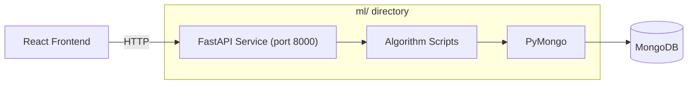

# ML Service — Recommendations, Trending & Deals

## Overview

Adaa includes a **Python-based ML service** built with **FastAPI** that provides product recommendations, trending products, and deals of the month. It connects directly to the same MongoDB database used by the Node.js backend and runs as a separate microservice.

---

## Architecture



---

## Directory Structure

```
ml/
├── api/
│   ├── app.py                     # FastAPI entry point
│   └── routes/
│       ├── recommendation.py      # /api/recommend/:user_id
│       ├── trending.py            # /api/trending
│       └── deals.py               # /api/deals
├── scripts/
│   ├── recommendation.py          # Recommendation algorithm
│   ├── trending.py                # Trending algorithm
│   ├── deals.py                   # Deals algorithm
│   └── test_algorithms.py         # Test runner
└── utils/
    ├── __init__.py
    ├── db.py                      # MongoDB connection via PyMongo
    └── data_loader.py             # Data fetching helpers
```

---

## API Endpoints (port 8000)

| Method | Endpoint                  | Description                                    |
| ------ | ------------------------- | ---------------------------------------------- |
| GET    | `/api/recommend/:user_id` | Get personalized product recommendations       |
| GET    | `/api/trending`           | Get trending products sorted by sales          |
| GET    | `/api/deals`              | Get top 10 deals sorted by discount percentage |

---

## Algorithms

### 1. Product Recommendations (`scripts/recommendation.py`)

#### `recommend_products(user_id)`

Generates personalized recommendations for a user.

**Algorithm:**
1. Fetches user's activity data (viewed, searched, purchased products)
2. If no activity data exists → returns **10 random products**
3. Otherwise, collects products from:
   - `viewedProducts` — products the user viewed
   - `searchedProducts` — products found via search
   - `purchasedProducts` — products the user bought
4. Matches these product IDs against the full product catalog
5. Fills remaining spots (up to 10) with random products
6. Returns top 10 recommendations

```python
def recommend_products(user_id):
    user_data = get_user_activity(user_id)
    all_products = get_all_products()

    if not user_data:
        return random.sample(all_products, min(10, len(all_products)))

    viewed = {p["productId"] for p in user_data.get("viewedProducts", [])}
    searched = {p["productId"] for p in user_data.get("searchedProducts", [])}
    purchased = set(user_data.get("purchasedProducts", []))

    recommended = [p for p in all_products 
                   if p["_id"] in (searched | viewed | purchased)]

    # Fill with random products up to 10
    while len(recommended) < 10:
        rand = random.choice(all_products)
        if rand["_id"] not in recommended:
            recommended.append(rand)

    return recommended[:10]
```

---

### 2. Trending Products (`scripts/trending.py`)

#### `get_trending_products()`

Returns all products sorted by total sales (from reviews).

**Algorithm:**
1. Fetches all products
2. For each product, sums up `sales` from its `reviews` array
3. Sorts products by total sales in descending order
4. Returns the sorted list

```python
def get_trending_products():
    all_products = get_all_products()
    
    for product in all_products:
        if isinstance(product.get('reviews'), list):
            total_sales = sum(r.get('sales', 0) for r in product['reviews'])
        else:
            total_sales = 0
        product['total_sales'] = total_sales

    return sorted(all_products, key=lambda p: p.get('total_sales', 0), reverse=True)
```

---

### 3. Deals of the Month (`scripts/deals.py`)

#### `get_deals_of_the_month()`

Returns the top 10 products with the highest discount percentages.

```python
def get_deals_of_the_month():
    all_products = get_all_products()
    deals = sorted(all_products, key=lambda p: p.get("discountPercent", 0), reverse=True)
    return deals[:10]
```

---

## Data Layer

### `utils/db.py` — MongoDB Connection

```python
from pymongo import MongoClient
import os

def get_db():
    client = MongoClient(os.getenv('MONGO_URI'))
    db = client[os.getenv('DB_NAME')]
    return db
```

### `utils/data_loader.py` — Data Helpers

| Function                    | Description                                    |
| --------------------------- | ---------------------------------------------- |
| `get_user_activity(user_id)`| Finds user activity from `useractivities` collection |
| `get_all_products()`        | Fetches all documents from `products` collection   |

---

## Running the ML Service

### Prerequisites
- Python 3.8+
- PyMongo, FastAPI, Uvicorn, python-dotenv

### Environment Variables

Create a `.env` file in the `ml/` directory:

```env
MONGO_URI=mongodb+srv://<user>:<pass>@cluster.mongodb.net/
DB_NAME=adaa
```

### Start the Server

```bash
cd ml
pip install fastapi uvicorn pymongo python-dotenv
python api/app.py
```

Server starts at `http://localhost:8000`.

### Run Tests

```bash
cd ml
python scripts/test_algorithms.py
```

---

## Entry Point (`api/app.py`)

```python
from fastapi import FastAPI
from routes.recommendation import router as recommend_router
from routes.trending import router as trending_router
from routes.deals import router as deals_router

app = FastAPI()

app.include_router(recommend_router, prefix="/api")
app.include_router(trending_router, prefix="/api")
app.include_router(deals_router, prefix="/api")

if __name__ == "__main__":
    import uvicorn
    uvicorn.run(app, host="0.0.0.0", port=8000)
```
