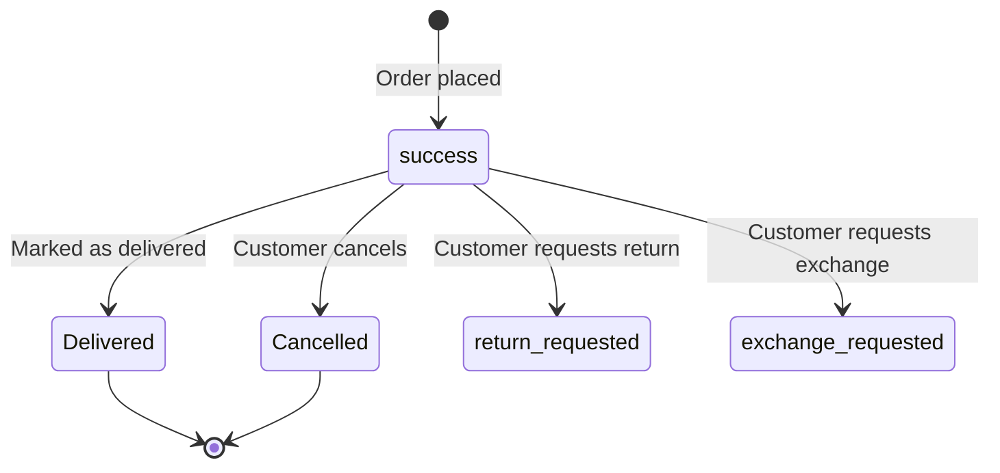

# Orders System

## Overview

The order system handles the complete order lifecycle from placement through cancellation. Customers can place orders individually or convert their entire cart into orders. Orders support COD and Razorpay online payments.

---

## Backend Files

| File                      | Purpose                        |
| ------------------------- | ------------------------------ |
| `controllers/order.js`    | Order CRUD & status management |
| `routes/orderRoutes.js`   | Order route definitions        |
| `models/Orders.js`        | Order schema                   |

## Frontend Files

| File                                | Purpose                        |
| ----------------------------------- | ------------------------------ |
| `components/customer/OrdersPage.jsx`| Orders listing page            |
| `components/customer/OrderCard.jsx` | Individual order display card   |
| `components/customer/Checkout.jsx`  | Checkout page                  |

---

## API Endpoints (`/api/orders`)

| Method | Endpoint                    | Description                              |
| ------ | --------------------------- | ---------------------------------------- |
| GET    | `/`                         | Get all orders for the authenticated user |
| GET    | `/:id`                      | Get a single order by ID                  |
| GET    | `/ordersByStatus`           | Filter orders by status                   |
| POST   | `/`                         | Create a single order                     |
| POST   | `/addAllProductsOfCart`     | Convert entire cart to orders             |
| PUT    | `/updateOrder`              | Update order details                      |
| POST   | `/cancel/:id`               | Cancel an order                           |
| POST   | `/:id`                      | Mark order as delivered                   |
| POST   | `/return`                   | Request a return                          |
| POST   | `/exchange`                 | Request an exchange                       |

---

## Controller Functions

### `createOrder(req, res)`

Creates a single order for one product.

**Input:** `{ productId, addressId, quantity, paymentMethod, paymentStatus }`

**Flow:**
1. Validates user from cookie
2. Fetches product → checks stock availability
3. Decreases product stock by `quantity`
4. Creates `Orders` document
5. Emits `products updated` via Socket.IO

### `addAllProductsOfCart(req, res)`

Bulk-creates orders from the user's entire cart.

**Input:** `{ orderType, paymentMethod, paymentStatus }`

**Flow:**
1. Fetches all cart items for the user with populated product data
2. Maps each cart item to an order object
3. Uses `Orders.insertMany()` for batch insert
4. Deletes all cart items with `Cart.deleteMany()`
5. Emits `products updated` via Socket.IO

### `getOrdersByUserId(req, res)`

Returns all orders for the authenticated user with populated `productId` and `addressId`.

### `getById(req, res)`

Returns a single order by its MongoDB `_id`.

### `delivered(req, res)`

Marks an order as `"Delivered"`:
```js
order.orderStatus = "Delivered";
await order.save();
```

### `cancelled(req, res)`

Marks an order as `"Cancelled"`:
```js
data.orderStatus = "Cancelled";
await data.save();
```

### `updateOrder(req, res)`

Generic update — takes `orderId` and any fields to update via `$set`.

### `getOrdersByStatus(req, res)`

Filters orders by `orderStatus` parameter (e.g., "success", "Delivered", "Cancelled").

### `requestReturn(req, res)`

Sets order status to `return_requested` with a return reason:
```js
{ orderStatus: 'return_requested', returnReason: reason }
```

### `requestExchange(req, res)`

Sets order status to `exchange_requested` with reason and exchange product:
```js
{ orderStatus: 'exchange_requested', exchangeReason: reason, exchangeProductId }
```

---

## Data Model

### `Orders` Schema

| Field            | Type                    | Description                               |
| ---------------- | ----------------------- | ----------------------------------------- |
| `userId`         | ObjectId (ref: User)    | Required. The customer who placed the order |
| `productId`      | ObjectId (ref: Product) | The ordered product                        |
| `price`          | Number                  | Price at time of order                     |
| `discount`       | Number                  | Discount applied                           |
| `addressId`      | ObjectId (ref: Address) | Shipping address                           |
| `quantity`       | Number                  | Required. Default: 1                       |
| `orderType`      | String                  | Required. E.g., "normal"                   |
| `paymentMethod`  | String                  | "COD" or "Razorpay"                        |
| `paymentStatus`  | String                  | "pending", "completed", etc.               |
| `orderStatus`    | String                  | Default: "success". See status flow below  |
| `orderDate`      | Date                    | Default: `Date.now`                        |
| `deliveryDate`   | Date                    | Set when delivered                         |
| `createdAt`      | Date                    | Auto-managed                               |
| `updatedAt`      | Date                    | Auto-managed                               |

### Order Status Flow



---

## UserBehavior Model

The `UserBehavior` model tracks customer payment patterns for COD restriction logic:

| Field                     | Type    | Description                            |
| ------------------------- | ------- | -------------------------------------- |
| `userId`                  | ObjectId| Reference to the user                   |
| `rejected_cod_count`      | Number  | Count of rejected COD orders            |
| `cod_returns_count`       | Number  | Count of COD returned orders            |
| `successful_prepaid_count`| Number  | Count of successful prepaid orders      |
| `cod_restricted`          | Boolean | Whether COD is disabled for this user   |
| `restriction_reason`      | String  | Reason for COD restriction              |
