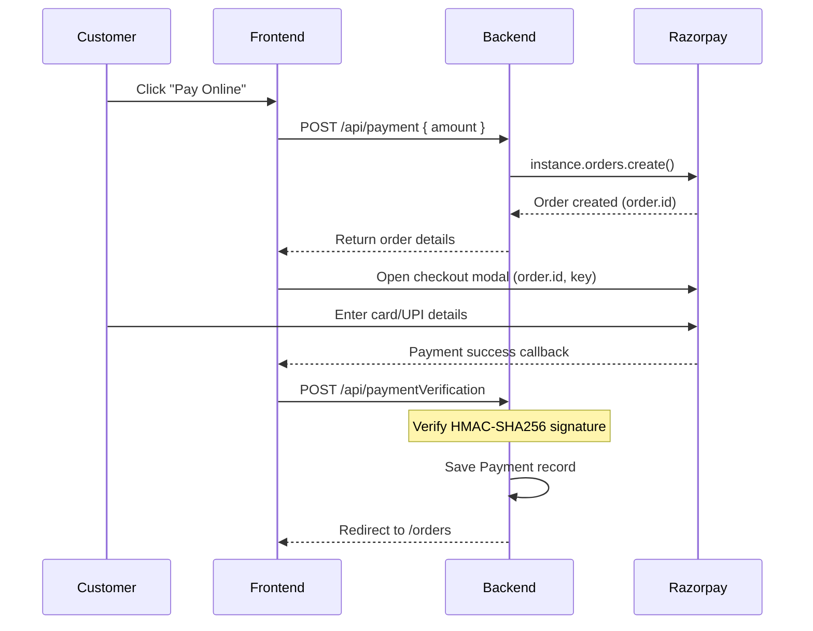

# Payments (Razorpay)

## Overview

Adaa integrates **Razorpay** for online payments. The system supports two payment methods:
1. **COD (Cash on Delivery)** — No payment gateway involved; orders are placed directly.
2. **Online Payment (Razorpay)** — Server creates an order, client opens Razorpay modal, then server verifies the payment signature.

---

## Backend Files

| File                       | Purpose                           |
| -------------------------- | --------------------------------- |
| `controllers/payment.js`  | Checkout & payment verification   |
| `routes/payment.js`       | Payment route definitions         |
| `models/Payment.js`       | Payment record schema             |

## Frontend Files

| File                              | Purpose                           |
| --------------------------------- | --------------------------------- |
| `components/customer/Checkout.jsx`| Checkout page with Razorpay integration |

---

## API Endpoints (`/api`)

| Method | Endpoint              | Description                              |
| ------ | --------------------- | ---------------------------------------- |
| POST   | `/payment`            | Create a Razorpay order                  |
| POST   | `/paymentVerification` | Verify Razorpay payment signature       |

---

## Controller Functions

### `checkout(req, res)`

Creates a Razorpay order.

**Input:** `{ amount }` — amount in paise (e.g., ₹100 = 10000 paise)

**Flow:**
1. Creates Razorpay order with `{ amount, currency: "INR" }`
2. Returns the order object (contains `order.id` needed by the frontend)

**Response:**
```json
{
  "success": true,
  "order": {
    "id": "order_xxxxx",
    "amount": 10000,
    "currency": "INR",
    "status": "created"
  }
}
```

### `paymentVerification(req, res)`

Verifies the payment signature from Razorpay's callback.

**Input:** `{ razorpay_order_id, razorpay_payment_id, razorpay_signature }`

**Flow:**
1. Constructs body string: `razorpay_order_id + "|" + razorpay_payment_id`
2. Generates expected signature using HMAC-SHA256 with `RAZOR_API_SECRET`
3. Compares signatures
4. If authentic → saves payment record to MongoDB → redirects to `/orders`
5. If failed → returns 400 error

**Signature Verification:**
```js
const expectedSignature = crypto
    .createHmac("sha256", process.env.RAZOR_API_SECRET)
    .update(body.toString())
    .digest("hex");

const isAuthentic = expectedSignature === razorpay_signature;
```

---

## Data Model

### `Payment` Schema

| Field                  | Type   | Description                             |
| ---------------------- | ------ | --------------------------------------- |
| `razorpay_order_id`    | String | Required. Razorpay order identifier     |
| `razorpay_payment_id`  | String | Required. Razorpay payment identifier   |
| `razorpay_signature`   | String | Required. Verification signature        |

---

## Payment Flow



---

## Environment Variables Required

| Variable           | Description                |
| ------------------ | -------------------------- |
| `RAZOR_API_KEY`    | Razorpay Key ID            |
| `RAZOR_API_SECRET` | Razorpay Key Secret        |
