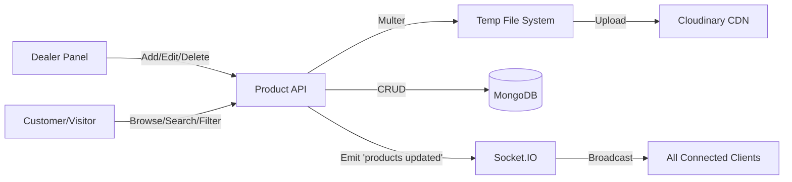
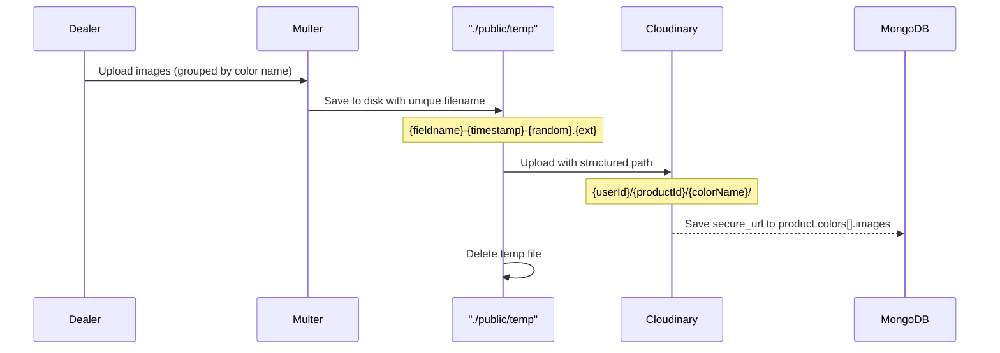

# Product Management

## Overview

Products are the core entity of Adaa. They support:
- Multi-color variants with per-color image galleries
- Size options (XXS to 6XL)
- Discount percentages & deals
- User reviews and ratings
- Full-text search with autocomplete suggestions
- Category/price/size/color filtering
- Real-time updates via Socket.IO

---

## Architecture



---

## Backend Files

| File                          | Purpose                              |
| ----------------------------- | ------------------------------------ |
| `controllers/products.js`     | All product CRUD & search logic      |
| `controllers/dealer.js`       | Dealer-specific product listing      |
| `routes/products.js`          | Public product routes                |
| `routes/dealerRoutes.js`      | Dealer-protected product routes      |
| `models/Product.js`           | Mongoose product schema              |
| `services/cloudinary.js`      | Cloudinary upload/delete helpers     |
| `middlewares/multer.middleware.js` | File upload configuration       |

---

## Frontend Files

| File                                     | Purpose                              |
| ---------------------------------------- | ------------------------------------ |
| `components/pages/Shop.jsx`              | Product listing page with filters    |
| `components/pages/ProductDetail.jsx`     | Single product view with gallery     |
| `components/pages/Deals.jsx`             | Deals of the month page              |
| `components/pages/NewArrivalsPage.jsx`   | New arrivals page                    |
| `components/searchProducts/SearchResults.jsx` | Search results with filters     |
| `components/design/SearchBar.jsx`        | Global search bar with suggestions   |
| `components/dealer/DealerProducts.jsx`   | Dealer's product list                |
| `components/dealer/DealerProductForm.jsx`| Add new product form                 |
| `components/dealer/DealerProductEditForm.jsx` | Edit existing product           |
| `components/dealer/DealerProductDetail.jsx`   | Dealer product detail view      |

---

## API Endpoints

### Public Product Routes (`/api/products`)

| Method | Endpoint              | Description                                   |
| ------ | --------------------- | --------------------------------------------- |
| GET    | `/`                   | Get all products                               |
| GET    | `/:id`                | Get single product by ID                       |
| GET    | `/search/:searchText` | Full-text search across name, title, description |
| GET    | `/suggestions?q=`     | Autocomplete suggestions (prefix match on name)|
| GET    | `/dealsOfMonth`       | Top 10 products by discount (in-stock only)    |
| GET    | `/newArrivals`        | Latest 10 products sorted by creation date     |
| POST   | `/filter`             | Filter products by category, price, etc.       |

### Dealer Routes (`/api/dealer`) — *Requires dealer role*

| Method | Endpoint            | Description                             |
| ------ | ------------------- | --------------------------------------- |
| GET    | `/getAllProducts`    | Get all products owned by the dealer    |
| POST   | `/add`              | Add new product (with file uploads)     |
| PUT    | `/updateProduct`    | Update existing product (with files)    |
| DELETE | `/deleteProduct/:id`| Delete product and its Cloudinary images|

---

## Controller Functions

### `controllers/products.js`

#### `addProduct(req, res)`
Creates a new product with color-wise image uploads.

**Input (multipart/form-data):**
```
name, title, description, price, discount, stock,
colorNames (JSON array), colorValues (JSON array),
gender, category, size (JSON array), material, brand
+ file uploads keyed by color name
```

**Flow:**
1. Parses JSON fields from `req.body`
2. Creates `Product` document with empty image arrays
3. Groups uploaded files by color name (`file.fieldname`)
4. Uploads each file to Cloudinary under `{userId}/{productId}/{colorName}/`
5. Saves image URLs back to the product
6. Emits `products updated` via Socket.IO
7. Cleans up temporary files

#### `updateProduct(req, res)`
Updates product fields and manages image additions/removals.

**Key Logic:**
- Compares incoming color list with existing — marks removed colors' images for Cloudinary deletion
- For retained colors, diffs `existingImagesByColor` against stored URLs to find removals
- Uploads new files for each color
- Merges kept + new image URLs
- Deletes old Cloudinary images after successful DB save

#### `removeProduct(req, res)`
Deletes a product and all its Cloudinary images.

**Flow:**
1. Fetches product → collects all image URLs from all colors
2. Calls `deleteCloudinaryImageFromUrl()` for each image
3. Deletes product from MongoDB
4. Emits `products updated` via Socket.IO

#### `getAllProducts(req, res)`
Returns all products: `Product.find()`

#### `getProduct(req, res)`
Returns single product by `req.params.id`

#### `filterProduct(req, res)`
Builds a dynamic MongoDB query from filter criteria:

| Filter Field      | MongoDB Operator              |
| ----------------- | ----------------------------- |
| `categoryOfProduct` | `$eq`                       |
| `priceRange`      | `$gte` / `$lte` (split by `-`) |
| `discountRange`   | `$gte` / `$lte` (split by `-`) |
| `size`            | `$in`                         |
| `color`           | `$in`                         |
| `material`        | `$in`                         |

Also filters out `stock === 0` products.

#### `searchProducts(req, res)`
- Creates case-insensitive regex from search text
- Searches across `name`, `title`, `description` using `$or` + `$regex`
- If user is authenticated, logs search to `UserActivities` collection

#### `getDealsOfTheMonth(req, res)`
```js
Product.find({ discountPercent: { $gt: 0 }, stock: { $gt: 0 } })
    .sort({ discountPercent: -1, createdAt: -1 })
    .limit(10)
```

#### `getNewArrivals(req, res)`
```js
Product.find({ stock: { $gt: 0 } })
    .sort({ createdAt: -1 })
    .limit(10)
```

#### `handleSuggestion(req, res)`
Autocomplete for search bar:
```js
Product.find({ name: new RegExp('^' + query, 'i') }).limit(10).select('name')
```
Returns `[{ id, text }]`

---

### `controllers/dealer.js`

#### `giveProducts(req, res)`
Returns all products where `dealerId` matches the authenticated dealer's user ID.

---

## Data Model

### `Product` Schema

| Field               | Type                    | Description                                    |
| ------------------- | ----------------------- | ---------------------------------------------- |
| `dealerId`          | ObjectId (ref: User)    | The dealer who created the product              |
| `name`              | String                  | Required. Product name                          |
| `title`             | String                  | Required. Display title                         |
| `description`       | String                  | Product description                             |
| `brand`             | String                  | Brand name                                      |
| `price`             | Number                  | Required. Price in INR                          |
| `categoryOfProduct` | String                  | Product category (e.g., "Shirts")               |
| `gender`            | String                  | Target gender                                   |
| `size`              | [String]                | Enum: XXS → 6XL                                |
| `colors`            | Array of `{ colorName, images }` | Per-color image galleries             |
| `material`          | String                  | Fabric material                                 |
| `discountPercent`   | Number                  | Discount percentage (0–100)                     |
| `productType`       | String                  | Default: `new`                                  |
| `stock`             | Number                  | Available quantity. Default: 0                   |
| `reviews`           | Array of `{ userId, rating, comment, createdAt }` | User reviews       |
| `features`          | [String]                | Product features list                           |
| `offers`            | `{ bankOffers, partnersOffers }` | Promotional offers                   |
| `warrantyDetails`   | String                  | Warranty information                            |
| `createdAt`         | Date                    | Auto-managed by Mongoose timestamps              |
| `updatedAt`         | Date                    | Auto-managed by Mongoose timestamps              |

---

## Image Upload Pipeline



**File constraints:**
- Max size: **5 MB** per file
- Allowed types: `image/jpeg`, `image/png`, `image/webp`

---

## Real-Time Updates

When any product is created, updated, or deleted, `updateProductsUsingSocketIo()` emits a `"products updated"` event to **all connected clients**. The frontend listens for this event and re-fetches product data.
