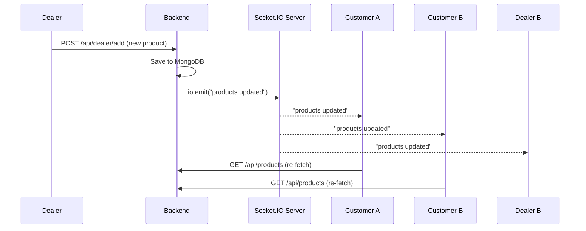

# Real-Time Features (Socket.IO)

## Overview

Adaa uses **Socket.IO** for real-time communication between the backend and all connected frontend clients. Currently, the primary use case is **live product updates** — when any product is created, updated, or deleted, all clients are instantly notified to refresh their product data.

---

## Backend Setup

### File: `services/socket.js`

```js
const { Server } = require('socket.io');

let io;

function initSocket(server) {
    io = new Server(server, {
        cors: {
            origin: [process.env.CLIENT_URL, process.env.CLIENT_URL_FOR_CORS],
            credentials: true
        }
    });

    io.on('connection', (socket) => {
        console.log(`user connected ${socket.id}`);
    });

    return io;
}

function getIo() {
    if (!io) throw new Error('socket io not initialized');
    return io;
}

function updateProductsUsingSocketIo() {
    if (io) {
        io.emit('products updated');
    }
}
```

### Initialization in `index.js`

```js
const { createServer } = require('node:http');
const { initSocket } = require("./services/socket");

const server = createServer(app);
initSocket(server);

// Server listens via HTTP server (not Express app)
server.listen(PORT);
```

---

## Events

### `products updated` (Server → Client)

**Emitted when:**
- A dealer adds a new product (`addProduct`)
- A dealer updates a product (`updateProduct`)
- A dealer deletes a product (`removeProduct`)
- A customer places an order (`createOrder`) — because stock changes
- Cart items are converted to orders (`addAllProductsOfCart`) — because stock changes

**Purpose:** Ensures all connected clients see the latest product data (stock levels, new products, etc.) without requiring a page refresh.

### `connection` (Client → Server)

Logged when a new client connects. Currently only used for debugging.

---

## Frontend Integration

The frontend uses `socket.io-client` to connect and listen for events.

**Dependency:** `"socket.io-client": "^4.8.1"` in `package.json`

**Typical usage pattern:**
```jsx
import { io } from "socket.io-client";

useEffect(() => {
    const socket = io(BACKEND_URL, { withCredentials: true });
    
    socket.on('products updated', () => {
        // Re-fetch products
        fetchProducts();
    });

    return () => socket.disconnect();
}, []);
```

---

## Architecture



---

## CORS Configuration

Socket.IO is configured with the same CORS origins as the Express server:

```js
cors: {
    origin: [process.env.CLIENT_URL, process.env.CLIENT_URL_FOR_CORS],
    credentials: true
}
```

This ensures that only the intended frontend origins can establish WebSocket connections.
